# Honeycomb Social Network


## About

The live website can be accessed by visiting this [link](https://django-social-network-project.herokuapp.com/).

This web application is a social network for people who want to share their knowledge and experiences with others and at the same time keep in touch with the people who are interested in the same things.
The application allows to communicate with other users by messages, posting, commenting, and reacting to their posts and comments.

## User Experience Design

### Strategy
Developed for the purpose to make the communication free and easy. The main goal of the application is to make the user experience as pleasant as possible and prolong the user's time on the site.

### Target Audience
People who cannot stand the complexity of modern social media apps and want to have a simple and easy-to-use interface.

### User Stories

#### First Time Visitor Goals
- As a First Time Visitor, I want to be able to easily understand the main purpose of the app, so that I can learn more about this app.
- As a First Time Visitor, I want to be able to easily navigate through the app, so that I can find presented content.
- As a First Time Visitor, I want to be able to register my account, so that I can learn the benefits of the app as a user.
- As a First Time Visitor, I want to be able to find the app useful, so that I can use it according to my needs.

#### Frequent Visitor Goals
- As a Frequent User, I want to be able to log in to my account, so that I can have a personal account.
- As a Frequent User, I want to be able to easily navigate through the app, so that I can find the content without additional efforts.
- As a Frequent User, I want to be able to easily log in and log out, so that I can access my personal account information.
- As a Frequent User, I want to be able to easily recover my password in case I forget it, so that I can recover access to my account.
- As a Frequent User, I can be able to change my password, so that I can be sure that nobody else can access my account.
- As a Frequent User, I want to be able to update my personal data, so that I can keep my account up to date.
- As a Frequent User, I want to be able to update my avatar, so that I can keep my avatar up to date.
- As a Frequent User, I want to be able to delete my profile, so that I can remove my account from the app.
- As a Frequent User, I want to be able to add friends, so that I can communicate with my friends.
- As a Frequent User, I want to be able to delete friends, so that I can feel safe in this social network.
- **As a Frequent User, I want to be able to see whether users are online, so that I can know who is online.**
- As a Frequent User, I want to be able to search through the users of the social network, so that I can find people who I am interested in.
- As a Frequent User, I want to be able to search people by their names, so that I can find people who I know.
- As a Frequent User, I want to be able to add a new post on my page or my friends' pages, so that I can share my knowledge and experiences with others.
- As a Frequent User, I want to be able to add a new comment on my post, so that I can share my knowledge and experiences with others.
- As a Frequent User, I want to be able to add a new comment to other people's post, so that I can share my knowledge and experiences with others.
- As a Frequent User, I want to be able to react to my post, so that I can share my knowledge and experiences with others.
- As a Frequent User, I want to be able to react to other people's post, so that I can share my knowledge and experiences with others.
- As a Frequent User, I want to be able to be able to edit/delete my posts, so that I can change my knowledge and experiences.
- As a Frequent User, I want to be able to create a community, so that I can share my ideas and interests with others.
- As a Frequent User, I want to be able to join a community, so that I can be a part of that community.
- As a Frequent User, I want to be able to add a new post in a community, so that I can share my ideas and interests with others.
- As a Frequent User, I want to be able to add a new comment on my community post, so that I can share my ideas and interests with others.
- As a Frequent User, I want to be able to share my experiences with other users, so that I can share my knowledge and experiences with others.
- As a Frequent User, I want to be able to send messages to other users, so that I can communicate with them.
- As a Frequent User, I want to be able to delete communities that I created, so that I can remove my community from the app.

## Technologies used
- ### Languages:
    + [Python](https://www.python.org/downloads/release/python-385/): the primary language used to develop the server-side of the website.
    + [JS](https://www.javascript.com/): the primary language used to develop interactive components of the website.
    + [HTML](https://developer.mozilla.org/en-US/docs/Web/HTML): the markup language used to create the website.
    + [CSS](https://developer.mozilla.org/en-US/docs/Web/css): the styling language used to style the website.
- ### Frameworks and libraries:
    + [Django](https://www.djangoproject.com/): python framework used to create all the backend logic of the website.
    + [jQuery](https://jquery.com/): was used to control click events and sending AJAX requests.
    + [jQuery User Interface](https://jqueryui.com/) was used to create interactive elements and animations.
    + [Django Channels](https://channels.readthedocs.io/en/latest/): was used to create real-time communication between users.
- ### Databases:
    + [SQLite](https://www.sqlite.org/): was used as a database during the development stage of the website.
    + [PostgreSQL](https://www.postgresql.org/): the database used to store all the data.
- ### Other tools:
    + [Linkify](https://linkify.js.org/) was used to transform URLs sent as chat messages into clickable link elements.
    + [EmojiOneArea](https://mervick.github.io/emojionearea/) was used to implement emoji picker in the chat.
    + [Moment.js](https://momentjs.com/) was used to format dates and times in the chat.
    + [Git](https://git-scm.com/): the version control system used to manage the code.
    + [Pip3](https://pypi.org/project/pip/): the package manager used to install the dependencies.
    + [Daphne](https://daphne.readthedocs.io/en/latest/): the webserver used to run the website.
    + [Cloudinary](https://cloudinary.com/): the image hosting service used to upload images and other media.
    + [Psycopg2](https://www.python.org/dev/peps/pep-0249/): the database driver used to connect to the database.
    + [Django-allauth](https://django-allauth.readthedocs.io/en/latest/): the authentication library used to create the user accounts.
    + [Heroku](https://dashboard.heroku.com/): the hosting service used to host the website.
    + [GitHub](https://github.com/): used to host the website's source code.
    + [VSCode](https://code.visualstudio.com/): the IDE used to develop the website.
    + [Chrome DevTools](https://developer.chrome.com/docs/devtools/open/): was used to debug the website.
    + [Font Awesome](https://fontawesome.com/): was used to create the icons used in the website.
    + [Coolors](https://coolors.co/202a3c-1c2431-181f2a-0b1523-65e2d9-925cef-6b28e0-ffffff-eeeeee) was used to make a color palette for the website.
    + [BGJar](https://www.bgjar.com/): was used to make a background images for the website.
    + [W3C Validator](https://validator.w3.org/): was used to validate HTML5 code for the website.
    + [W3C CSS validator](https://jigsaw.w3.org/css-validator/): was used to validate CSS code for the website.
    + [JShint](https://jshint.com/): was used to validate JS code for the website.
    + [PEP8](https://pep8.org/): was used to validate Python code for the website.


## Features

**Home Page**

When the user is logged out, the website will display a landing page with a login button and a sign up button.


At the bottom of the page, the user can see a the name of the coder and links to the coder's email, linkedin, and github.

**Sign Up Page**

Sign up page has a box for the user to enter their username, email, email confirmation, password, and password confirmation. After the user clicks the sign up button, the user will be advised to check their email for a confirmation link. It has also a link to sign in page. If the user clicks the link, the user will be redirected to the sign in page.


**Login Page**

Log in page has a box with 2 inputs where the user can enter their username/email and password. It also has a remember me checkbox and a login button. It has also a link to the sign up page at the top of the container and Forgot Password link at the bottom of the container. If user clicks on the Forgot Password link, the user will be redirected to the Forgot Password page. If user clicks on the Sign Up link, the user will be redirected to the Sign Up page.


When the user enters the correct username/email and password, the user will be redirected to the feed page.


**Navbar**


Navbar is located on the left side of the screen and has the following buttons:

- Profile button, which leads to the user's profile page.
- Feed button, which leads to the feed page.
- Friends button, which leads to the friends page.
- Communities button, which leads to the communities page.
- Messages button, which leads to the messages page.
- Search button, which leads to the search page.
- Logout button, which leads to the logout page.

If there are some incoming messages or friends requests, the user will see a notification icon on the navbar. **They are updated real-time with the use of the Django Channels library.**

For the mobile version, the navbar will be also on the left side of the screen but will show only icons and possible incoming messages or friends requests.

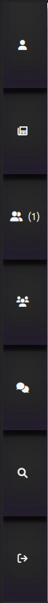

**Profile Page**


This page has a main container in which the user can see their profile information and post wall.

At the very top of the page, the user data container has the following information:

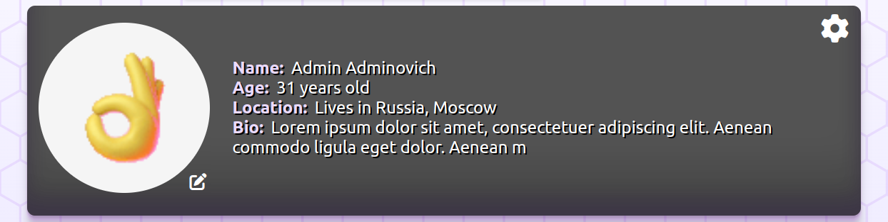

If the user is logged in and the user is viewing their own profile, the user can see the following buttons:

- Settings button, which leads to the settings page.

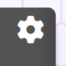

- Edit avatar button, which allows the user to change the avatar directly from the profile page with the use of ajax without reloading the page.

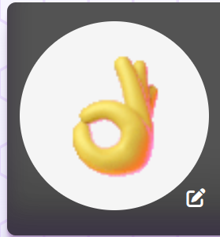

This box also consists of the following information about the user:
- name;
- age;
- location;
- bio;

If the user is viewing another user's profile, the user can see additional information on whether the user is online or not:

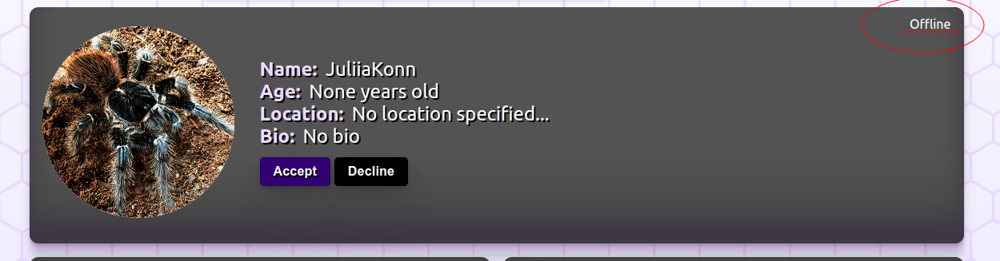


If the user is viewing user's profile of someone who send a friend request to the current user, the user can see the following buttons:

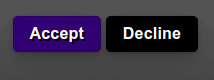

If the user clicks on the accept button, the user will become friends with the user who sent the friend request. If the user clicks on the decline button, the friend request will be declined.

As a result of accepting the friend request, the user will see the following buttons:


If the user clicks on the chat button, the user will be redirected to the chat page with this user. If the user clicks on the unfriend button, the user will be removed from the friends list.

If the user is viewing user's profile of someone who has not sent a friend request to the current user, the user can see the following:


When the user clicks on the add to friends button, the user will see the following buttons:

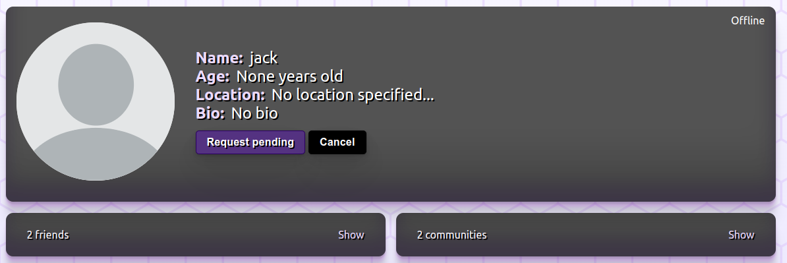.

If the user clicks cancel button, the friend request will be canceled. Request pending button is disabled till the other user accepts or declines the friend request, or the user cancels the friend request.

If the user views the other user's profile, under the profile data box their will find 2 blocks:

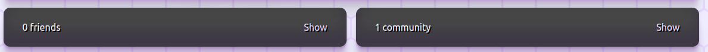

These blocks consists of the information of how many friends the user has and how many communities the user is in. If the user clicks on the button 'show' in the friends container, the modal window will appear with the list of the user's friends. if the user clicks on the button 'show' in the communities container, the modal window will appear with the list of the user's communities.

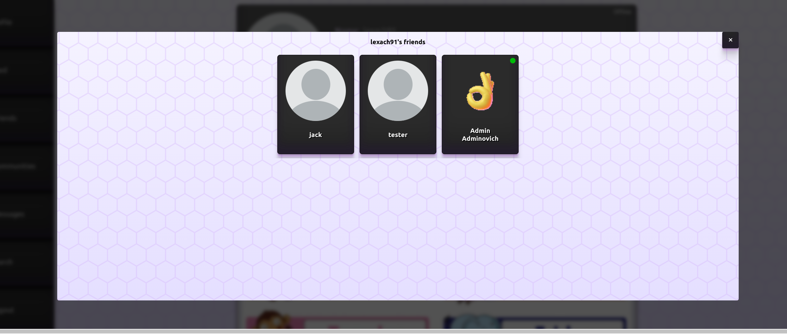

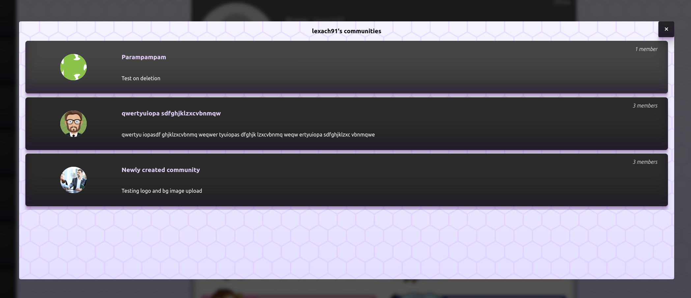

Under the profile data box, there is a post wall, which starts from the new post form where the user can write a new post.


Under the new post box, there is a posts container, which consists of the posts of the user's profile, it might be the posts from the user himself or the posts from the user's friends.


Each post has author's name, how long ago the post was made, and the post itself with statistics.
if the user is online, the user will see the following:


The statistics consist of the number of likes, comments, and dislikes.


If the user clicks on the comments icon, the comments will be displayed if there are any.


if the user wants to add comments to the post, the user will see the following:

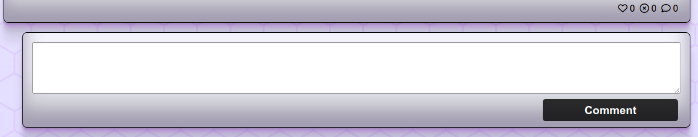


**Profile Settings Page**

This page has a main container in which the user can see their profile information and edit it.


Settings page has 3 forms:

1. Changing avatar form
2. Changing personal information form
3. Changing password form


Under these forms user can see the deletion button. When the user clicks on the button the user will see two options: Yes, delete and No, cancel.


If the user clicks on the Yes button, the user's account will be permanently deleted from the database.

**Feed Page**

This page represents the activity feed of the users that you are friends with and the communities that you are in.

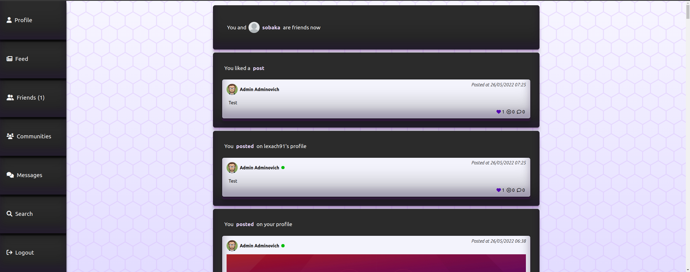

It shows the posts of the user's friends and the posts of the user himself, activities in the communities and info about confirmed friends requests.


**Friends Page**

This page represents the friends list of the user and friends requests.


It also has a navbar with the following buttons:

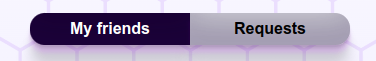

If the user clicks on the requests button, the user may see the incoming friend requests.

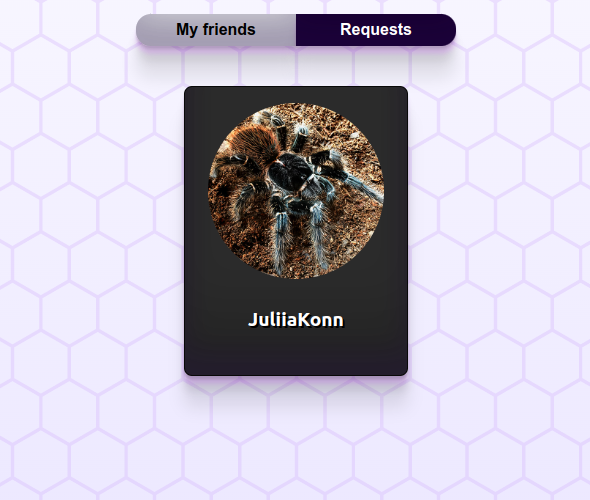

If the friend is online, it will be shown on their card:


**Communities Page**

This page represents the communities list of the user.

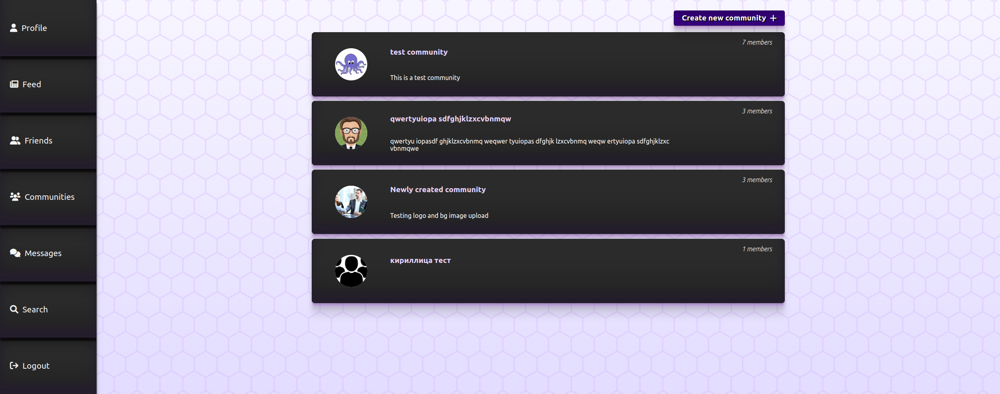

It has a new community button in the top right corner, which allows the user to create a new community.

When the user clicks on the new community button, the user will be redirected to the create community page.

If the user clicks on the community card, the user will be redirected to the community page.


**Community Page**

This page represents the community page.


It has a header with the community data: name, description, number of members and a button. If the user is the creator of the community, the user can see the settings button:

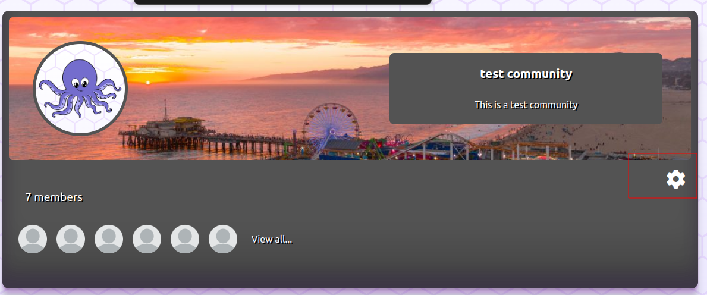

When the user clicks on the settings button, the user will be redirected to the community settings page.


If the user views a community that the user is a member of but not a creator, the user will see leave community button:

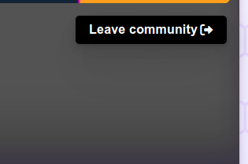


If the user views a community that the user is not a member of, the user will see join community button:


It also has data on the members of the community:

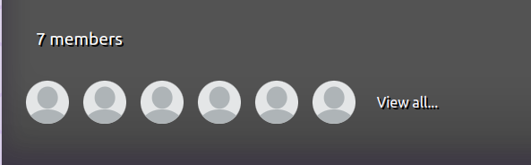

If the user clicks "view all", the modal window will appear with the list of the community's members.

Under the community data box, there is a post wall, which starts from the new post form where the user can write a new post.


**New Community Page**

This page has a main container in which the user can create a new community, add background image, logo, name, description.


**Community Settings Page**

This page has a main container in which the user can see a pre populated form with the community's data, which the user can edit.

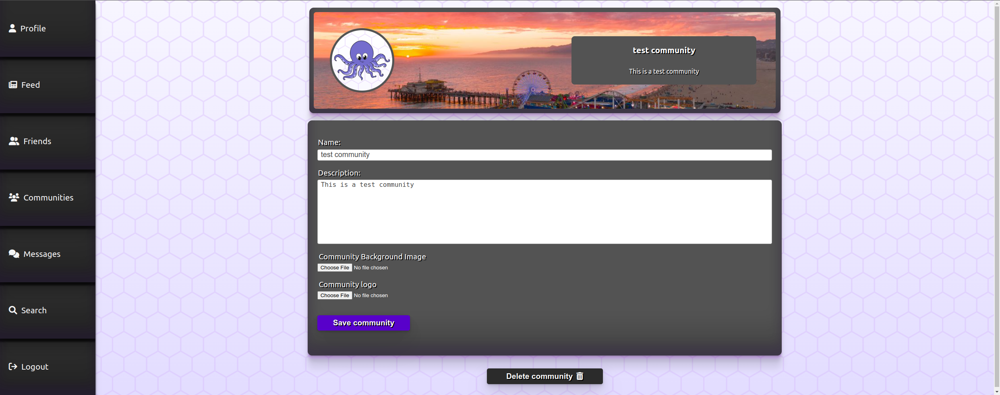


Under this form user can see the deletion button. When the user clicks on the button the user will see two options: Yes, delete and No, cancel.


If the user clicks on the Yes button, the community will be permanently deleted from the database.

**Messages Page**

This page represents the chats list of the user.

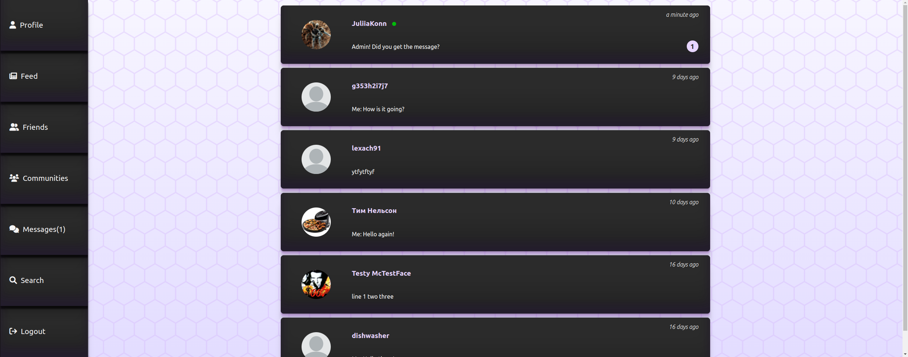

Each card has an avatar of the user with whom the user is chatting, their name, how long ago the last message was sent, and the last message content + online/offline status.


Unread messages are shown in pinkish circle with the number of unread messages in the chat.


**Chat Page**

This page represents the chat page with the user's friend.


It has a chat a navbar with the following data:

- friend's name and avatar with the link to the friend's profile
- online/offline status


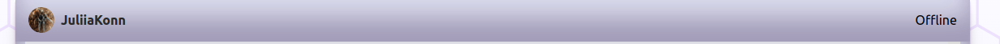

It also has a chat window where the user can find all the messages between the user and the friend.

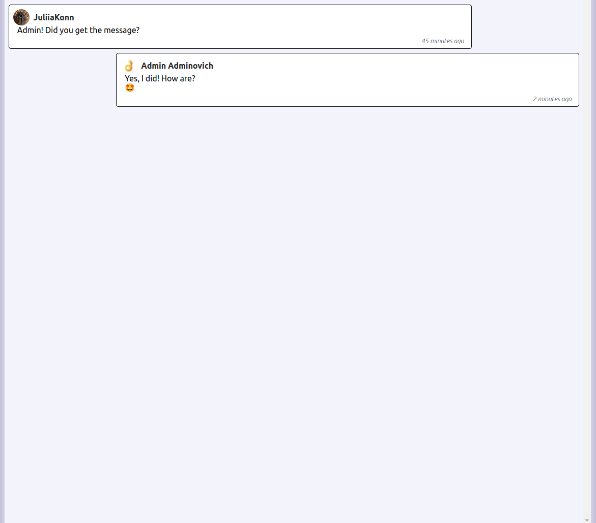

At the bottom of the chat window, the user can write a new in the message box.

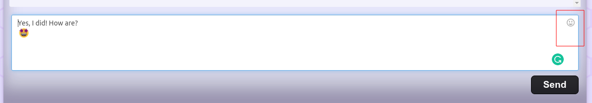

This box has an emoji button and a send button.

Additionally, the user can see whether the friend is typing or not.

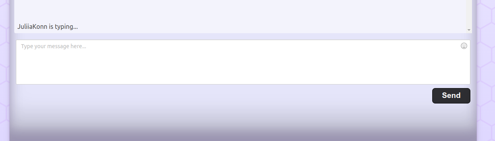


**Search Page**

This page represents the search page where the user can search for users and communities.


If the user didn't type anything in the search bar yet, they will be shown recommendations for users they may know if 'people' checkbox is checked, or recommendations for communities they can join if 'communities' checkbox is checked.


At the top of the search page, the user can see the search bar with text input, people/communities selection and reset button.

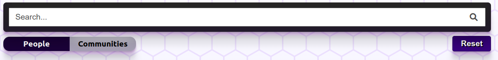

When the user types in the search bar, the search results will be shown. The search query is sent to the server on every key press.

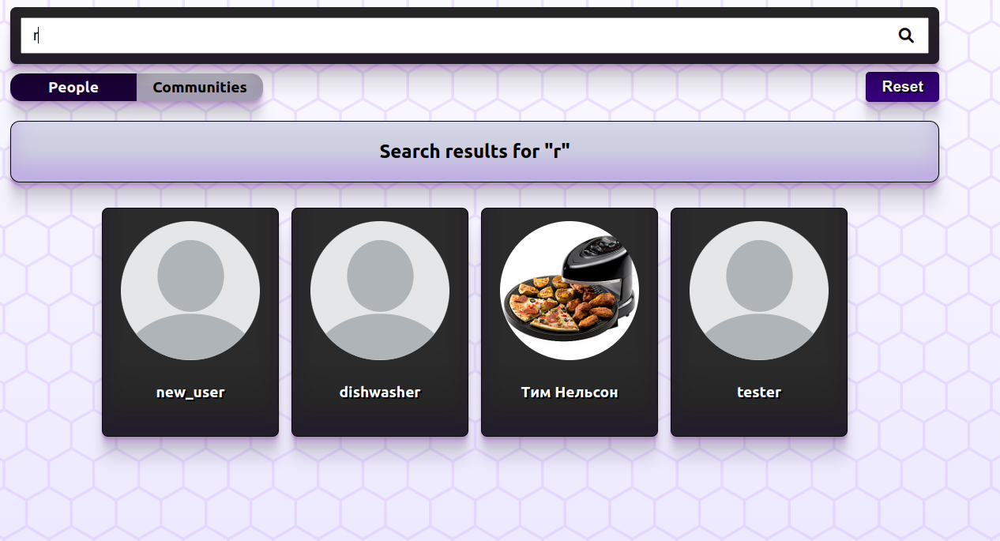

If the user clicks on the community selection button in the search navbar, the search results will be communities.

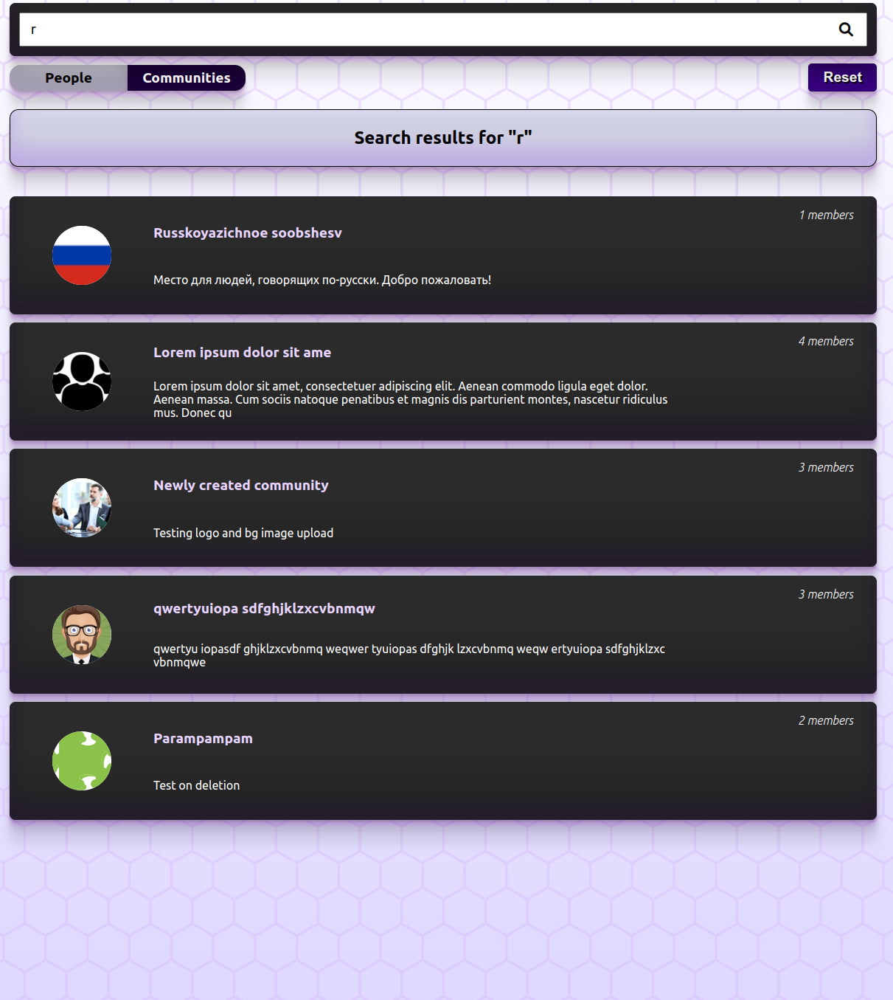

If the user clicks on the friend card or community card, the user will be redirected to the profile page of the user or community.


**Logout Page**

This page has a main container in which the user can logout.


**404 Error Page**

This page is shown when the user tries to access a page that doesn't exist.
It may contain a navbar if the user is logged in.

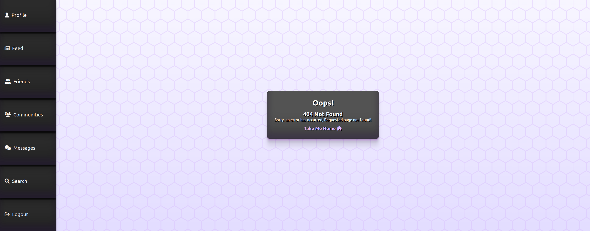

Or just an error message if the user is not logged in.

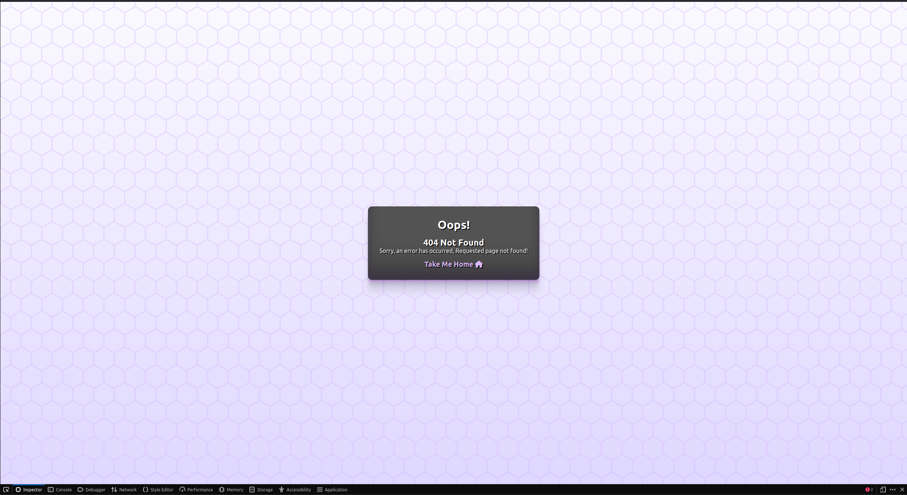

**500 Error Page**

This page is shown when the server is not able to process the request.


---

## Future Improvements and Features

**Sign-up and Login options**

In the future I would like to add sign-up and login with Facebook, Google, and other social media platforms.
Also, I would like to add an option to use a phone number instead of an email and send a verification code to the user's phone.

**Full asynchronous functionality**

In the future I would like to make the application fully asynchronous. So all elements in the frontend will be updated real-time as soon as the backend sends the data.

**Video and audio calls**

In the future I would like to add video and audio calls besides text messages.

**Chat improvements**

In the future I would like to allow users to send images, videos, files, and audio messages in the chat.

**Security improvements**

In the future I would like to make the application foolproof against attacks and security vulnerabilities.

**User settings**

In the future I would like to more customization options for the user.

**Group chatting**

In the future I would like to add group chatting for friends and communities.

**Community moderation**

In the future I would like to add community moderation options.

**Dynamic page loading**

In the future I would like to make the application load the pages dynamically and not to pass all the posts and users to the page at once.

---

## Design

The design of the application is based on the Material Design principles.
The central theme of the application is the simplicity of use. It was aimed to guide the user to the best experience.

### Color Scheme

The color scheme of the application is based on the dark grey and light purple colors:

  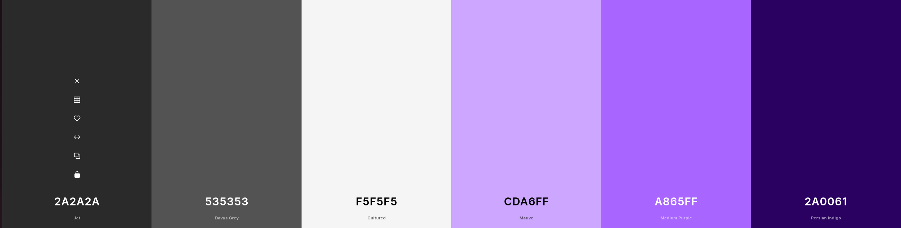

The decision to use this color palette was made due to the trend in the modern web design.


### Typography

The main font used in the application is Ubuntu. The use of this font is consistent with the color scheme. Needless to say, the Ubuntu font was chosen due to its readability, which increases user experience.

  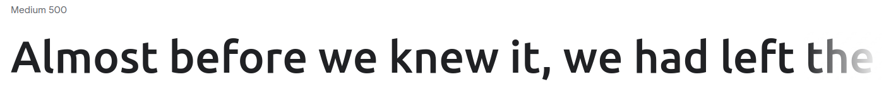


To emphasize the importance of the text, the font-weight was set to 900. To make the accent on the buttons, the font-weight was set to 700. For the rest of the text, the font-weight was set to 400.

### Imagery

- The main background image was generated with the use of the [BGJar](https://www.bgjar.com/) tool. The image was generated with the following settings:

  

To generate this particular pattern, I used Contour Line Generator with white background and #93D3FD54 as the color of the lines. 


- The main part is allocated to the use of icons from the [font awesome](https://fontawesome.com/) website. The use of icons is essential for the user experience when it comes to multifunctional websites.


### Wireframes

- [Wireframes can be accessed here](documentation/design/wireframes.pdf).

---

## Information Architecture

### Database

* During the earliest stages of the project, the database was created using SQLite.
* The database was then migrated to PostgreSQL.


### Data Modeling

**Entity relationship diagram**

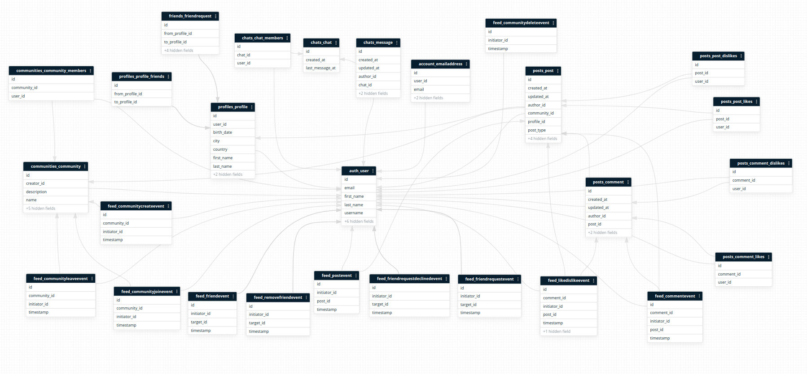

1. **Allauth User Model**
    - The user model was created using [Django-allauth](https://django-allauth.readthedocs.io/en/latest/).
    - The user model was then migrated to PostgreSQL.

2. **Profile Model**

| Name          | Database Key  | Field Type    | Validation |
| ------------- | ------------- | ------------- | ---------- |
| User          | user          | OneToOneField | User, on_delete=models.CASCADE, related_name='profile'    |
| Avatar        | avatar        | CloudinaryField    | folder='avatars', null=True, blank=True      |
| Birthday      | birth_date    | DateField    | null=True, blank=True      |
| First Name    | first_name    | CharField    | max_length=25, null=True, blank=True      |
| Last Name     | last_name     | CharField    | max_length=25, null=True, blank=True      |
| friends       | friends       | ManyToManyField | to=User, related_name='friends', blank=True      |
| Country       | country       | CharField    | max_length=50, null=True, blank=True      |
| City          | city          | CharField    | max_length=50, null=True, blank=True      |
| Bio           | bio           | TextField    | max_length=100, null=True, blank=True      |

3. **Community Model**

| Name          | Database Key  | Field Type    | Validation |
| ------------- | ------------- | ------------- | ---------- |
| Name          | name          | CharField    | max_length=30, unique=True, blank=False    |
| Slug          | slug          | SlugField    | unique=True, blank=False    |
| Description   | description   | TextField    | max_length=100, blank=True    |
| BG Image      | bg_image      | CloudinaryField    | folder='community_bg_images', null=True, blank=True    |
| Logo          | logo          | CloudinaryField    | folder='community_logos', null=True, blank=True    |
| Members       | members       | ManyToManyField | to=User, related_name='communities', blank=True    |
| Creator       | creator       | ForeignKey    | to=User, on_delete=models.CASCADE, related_name='created_communities'    |
| Created On    | created_on    | DateTimeField | auto_now_add=True    |
| Updated On    | updated_on    | DateTimeField | auto_now=True    |

4. **Chat Model**

| Name          | Database Key  | Field Type    | Validation |
| ------------- | ------------- | ------------- | ---------- |
| Members       | members       | ManyToManyField | to=User, related_name='chats', blank=True    |
| Created at    | created_at    | DateTimeField | auto_now_add=True    |
| Last message  | last_message_at  | DateTimeField | auto_now=True    |

5. **Message Model**


| Name          | Database Key  | Field Type    | Validation |
| ------------- | ------------- | ------------- | ---------- |
| Chat          | chat          | ForeignKey    | to=Chat, on_delete=models.CASCADE, related_name='messages'    |
| Author        | author        | ForeignKey    | to=User, on_delete=models.CASCADE, related_name='messages'    |
| Content       | content       | TextField    |   |
| Is Read       | is_read       | BooleanField | default=False      |
| Created at    | created_at    | DateTimeField | auto_now_add=True    |
| Updated at    | updated_at    | DateTimeField | auto_now=True    |

6. **Post Model**

```Python
POST_TYPE_CHOICES = (
    (1, 'profile_wall'),
    (2, 'community_wall'),
)
```

| Name          | Database Key  | Field Type    | Validation |
| ------------- | ------------- | ------------- | ---------- |
| Author        | author        | ForeignKey    | to=User, on_delete=models.CASCADE, related_name='posts'    |
| Content       | content       | TextField     | max_length=500    |
| Has Media     | has_media     | BooleanField  | default=False    |
| Image         | image         | CloudinaryField | 'post_image', folder = 'posts', null = True, blank = True   |
| Created On    | created_on    | DateTimeField | auto_now_add=True    |
| Updated On    | updated_on    | DateTimeField | auto_now=True    |
| Edited        | edited        | BooleanField  | default=False    |
| Post Type     | post_type     | IntegerField  | choices=POST_TYPE_CHOICES    |
| Community     | community     | ForeignKey    | to=Community, on_delete=models.CASCADE, related_name='posts'    |
| Profile       | profile       | ForeignKey    | to=Profile, on_delete=models.CASCADE, related_name='posts'    |
| Likes         | likes         | ManyToManyField | to=User, related_name='liked_posts'    |
| Dislikes      | dislikes      | ManyToManyField | to=User, related_name='disliked_posts'    |

7. **Comment Model**


| Name          | Database Key  | Field Type    | Validation |
| ------------- | ------------- | ------------- | ---------- |
| Author        | author        | ForeignKey    | to=User, on_delete=models.CASCADE, related_name='comments', null=True    |
| Post          | post          | ForeignKey    | to=Post, on_delete=models.CASCADE, related_name='comments'    |
| Content       | content       | TextField     | max_length=500    |
| Created On    | created_on    | DateTimeField | auto_now_add=True    |
| Updated On    | updated_on    | DateTimeField | auto_now=True    |
| Edited        | edited        | BooleanField  | default=False    |
| Likes         | likes         | ManyToManyField | to=User, related_name='liked_comments'    |
| Dislikes      | dislikes      | ManyToManyField | to=User, related_name='disliked_comments'    |


8. **FriendRequest Model**

| Name          | Database Key  | Field Type    | Validation |
| ------------- | ------------- | ------------- | ---------- |
| From Profile  | from_profile  | ForeignKey    | to=Profile, on_delete=models.CASCADE, related_name='friend_request_from_profile'    |
| To Profile    | to_profile    | ForeignKey    | to=Profile, on_delete=models.CASCADE, related_name='friend_request_to_profile'    |
| Sent On       | sent_on       | DateTimeField | auto_now_add=True    |
| Updated On    | updated_on    | DateTimeField | auto_now=True    |
| Accepted      | accepted      | BooleanField  | default=False    |
| Declined      | declined      | BooleanField  | default=False    |


9. **PostEvent Model**

| Name          | Database Key  | Field Type    | Validation |
| ------------- | ------------- | ------------- | ---------- |
| Initiator     | initiator     | ForeignKey    | to=User, on_delete=models.CASCADE, related_name='initiated_post_events'    |
| Post          | post          | ForeignKey    | to=Post, on_delete=models.CASCADE, related_name='post_events'    |
| Timestamp     | timestamp     | DateTimeField | auto_now_add=True    |
| Type          | type          | CharField    | "post_events"      |

10. **CommentEvent Model**

| Name          | Database Key  | Field Type    | Validation |
| ------------- | ------------- | ------------- | ---------- |
| Initiator     | initiator     | ForeignKey    | to=User, on_delete=models.CASCADE, related_name='initiated_comment_events'    |
| Post          | post          | ForeignKey    | to=Post, on_delete=models.CASCADE, related_name='comment_events'    |
| Comment       | comment       | ForeignKey    | to=Comment, on_delete=models.CASCADE, related_name='comment_events'    |
| Timestamp     | timestamp     | DateTimeField | auto_now_add=True    |
| Type          | type          | CharField    | "comment_events"      |

11. **LikeDislikeEvent Model**

| Name          | Database Key  | Field Type    | Validation |
| ------------- | ------------- | ------------- | ---------- |
| Initiator     | initiator     | ForeignKey    | to=User, on_delete=models.CASCADE, related_name='initiated_friend_request_events'    |
| Post          | post          | ForeignKey    | to=Post, on_delete=models.CASCADE, related_name='friend_request_events'    |
| Comment       | comment       | ForeignKey    | to=Comment, on_delete=models.CASCADE, related_name='friend_request_events'    |
| like          | like          | BooleanField  | default=False    |
| Timestamp     | timestamp     | DateTimeField | auto_now_add=True    |
| Type          | type          | CharField    | "like_dislike"    |

12. **FriendRequestEvent Model**

| Name          | Database Key  | Field Type    | Validation |
| ------------- | ------------- | ------------- | ---------- |
| Initiator     | initiator     | ForeignKey    | to=User, on_delete=models.CASCADE, related_name='initiated_friend_request_events'    |
| Target        | target        | ForeignKey    | to=User, on_delete=models.CASCADE, related_name='targeted_friend_request_events'    |
| Timestamp     | timestamp     | DateTimeField | auto_now_add=True    |
| Type          | type          | CharField    | "friend_request"      |

13. **FriendEvent Model**

| Name          | Database Key  | Field Type    | Validation |
| ------------- | ------------- | ------------- | ---------- |
| Initiator     | initiator     | ForeignKey    | to=User, on_delete=models.CASCADE, related_name='initiated_friend_events'    |
| Target        | target        | ForeignKey    | to=User, on_delete=models.CASCADE, related_name='targeted_friend_events'    |
| Timestamp     | timestamp     | DateTimeField | auto_now_add=True    |
| Type          | type          | CharField    | "friend_added" |

14. **FriendRequestDeclinedEvent Model**

| Name          | Database Key  | Field Type    | Validation |
| ------------- | ------------- | ------------- | ---------- |
| Initiator     | initiator     | ForeignKey    | to=User, on_delete=models.CASCADE, related_name='initiated_friend_request_declined_events'    |
| Target        | target        | ForeignKey    | to=User, on_delete=models.CASCADE, related_name='targeted_friend_request_declined_events'    |
| Timestamp     | timestamp     | DateTimeField | auto_now_add=True    |
| Type          | type          | CharField    | "friend_request_declined"   |

15. **RemoveFriendEvent Model**

| Name          | Database Key  | Field Type    | Validation |
| ------------- | ------------- | ------------- | ---------- |
| Initiator     | initiator     | ForeignKey    | to=User, on_delete=models.CASCADE, related_name='initiated_remove_friend_events'    |
| Target        | target        | ForeignKey    | to=User, on_delete=models.CASCADE, related_name='targeted_remove_friend_events'    |
| Timestamp     | timestamp     | DateTimeField | auto_now_add=True    |
| Type          | type          | CharField    | "friend_removed"      |

16. **CommunityJoinEvent Model**

| Name          | Database Key  | Field Type    | Validation |
| ------------- | ------------- | ------------- | ---------- |
| Initiator     | initiator     | ForeignKey    | to=User, on_delete=models.CASCADE, related_name='initiated_community_join_events'    |
| Community     | community     | ForeignKey    | to=Community, on_delete=models.CASCADE, related_name='community_join_events'    |
| Timestamp     | timestamp     | DateTimeField | auto_now_add=True    |
| Type          | type          | CharField    | "community_join"     |

17. **CommunityLeaveEvent Model**

| Name          | Database Key  | Field Type    | Validation |
| ------------- | ------------- | ------------- | ---------- |
| Initiator     | initiator     | ForeignKey    | to=User, on_delete=models.CASCADE, related_name='initiated_community_leave_events'    |
| Community     | community     | ForeignKey    | to=Community, on_delete=models.CASCADE, related_name='community_leave_events'    |
| Timestamp     | timestamp     | DateTimeField | auto_now_add=True    |
| Type          | type          | CharField    | "community_leave"      |

18. **CommunityCreateEvent Model**

| Name          | Database Key  | Field Type    | Validation |
| ------------- | ------------- | ------------- | ---------- |
| Initiator     | initiator     | ForeignKey    | to=User, on_delete=models.CASCADE, related_name='initiated_community_create_events'    |
| Community     | community     | ForeignKey    | to=Community, on_delete=models.CASCADE, related_name='community_create_events'    |
| Timestamp     | timestamp     | DateTimeField | auto_now_add=True    |
| Type          | type          | CharField    |"community_create"      |

19. **CommunityDeleteEvent Model**

| Name          | Database Key  | Field Type    | Validation |
| ------------- | ------------- | ------------- | ---------- |
| Initiator     | initiator     | ForeignKey    | to=User, on_delete=models.CASCADE, related_name='initiated_community_delete_events'    |
| Community     | community     | ForeignKey    | to=Community, on_delete=models.CASCADE, related_name='community_delete'    |
| Timestamp     | timestamp     | DateTimeField | auto_now_add=True    |
| Type          | type          | CharField    | community_delete"      |


---
## Testing
Please refer to the [TESTING.md](TESTING.md) file for all test-related documentation.
---
## Deployment

### Heroku

The website is hosted on Heroku and can be accessed by visiting this [link](https://django-social-network-project.herokuapp.com/).

The process for deploying the website to Heroku is as follows:

1. Create a Heroku account if you don't already have one.

2. Create a new app on Heroku.

    1. Go to the [Heroku dashboard](https://dashboard.heroku.com/apps).
    2. Click on the "New" button.
    3. Click on the "Create new app" button.
    4. Choose a name for your app.
    5. Choose a region.
    6. Click on the "Create app" button.

3. In your app go to the "Resources" tab.

    1. Add a Heroku Postgres database.
    2. Add a Heroku Redis database (heroku may ask you for your credit card details, but won't charge).

4. In your app go to the "Settings" tab, press "Reveal Config Vars", and add the following config vars if they are not already set:

    1. ```ALLOWED_HOSTS``` = your heroku domain name.
    2. ```CLOUDINARY_CLOUD_NAME``` = the cloud name you used when creating your cloudinary account.
    3. ```CLOUDINARY_API_KEY``` = the api key you got when created your cloudinary account.
    4. ```CLOUDINARY_API_SECRET``` = the api secret you got when created your cloudinary account.
    5. ```DATABASE_URL``` = the url of your heroku postgres database.
    6. ```REDIS_URL``` = the url of your heroku redis database.
    7. ```SECRET_KEY``` = a secret key for your app.
    8. ```EMAIL_HOST_USER``` = the email address you going to use to send emails.
    9. ```EMAIL_HOST_PASSWORD``` = the password for the email address you are using.
    10. ```DEBUG``` = True during development, False during production.
    11. ```DISABLE_COLLECTSTATIC``` = 1 during development. Remove this when deploying to production.

5. In your app go to the "Deploy" tab.

    1. If it's already possible, connect your Heroku account to your GitHub account and then click on the "Deploy" button.
    2. If not, you need to copy the Heroku CLI command to connect your heroku app and your local repository.

        - ```heroku git:remote -a <your-heroku-app-name>```

6. Go to your local repository.

7. Login to your Heroku account in your terminal and connect your local repository to your heroku app.

    1. ```heroku login -i``` - Enter all your Heroku credentials it will ask for.
    2. Paste the command you copied from step 5 into your terminal.

8. Create Procfile.

    For this project I used Daphne server for its ability to run asynchronous applications, so in my case I had the following Procfile:

    - ```release: python manage.py migrate``` - this command will apply all migrations every time you re-deploy the app.
    - ```web: daphne social_network.asgi:application --port $PORT --bind 0.0.0.0 -v2``` - this command will run the app.
    - ```worker: python manage.py runworker -v2 channel_layer``` - this command will run the worker for the channel layer to run the async tasks.

9. Create ```requirements.txt```. This can be done by running the following command:

    - ```pip freeze > requirements.txt```
    or
    - ```pipreqs requirements.txt``` - if you have pipreqs installed.

10. Add and commit all changes.

11. Push your changes to Heroku.

    - ```git push heroku master```
    or
    - ```git push heroku main```

12. Check the logs of your app in heroku dashboard and make sure everything is working.

13. After the development is done, you can change the ```DEBUG``` config var to ```False``` and remove the ```DISABLE_COLLECTSTATIC``` config var from the config vars on heroku.

To get cloudinary cloud name, api key, and api secret:

1. Go to the [Cloudinary website](https://cloudinary.com/).

2. Log in to your account or sign up if you don't have an account.

3. Go to the [Cloudinary dashboard](https://cloudinary.com/console/).

4. At the top of the page you will see your cloud name, api key, and api secret.

5. To reveal api secret, hover over the api key container and click on the button that looks like an eye.

6. Copy these values and paste them into the config vars on heroku and into your `env.py` file.


### Local Deployment

1. Clone the repository.

    - ```git clone https://github.com/lexach91/Django-social-network-PP4.git```

2. Go to the ```Django-social-network-PP4``` directory.

    - ```cd Django-social-network-PP4```

3. Create a virtual environment.

    - ```python3 -m venv venv```

    - ```source venv/bin/activate```

4. Install all dependencies.

    - ```pip install -r requirements.txt```

5. Create a ```env.py``` file.

    - ```touch env.py```

6. Add the following lines to ```env.py```:

    - ```import os```
    - ```os.environ["SECRET_KEY"]``` = your secret key.
    - ```os.environ["DEBUG"]``` = "True" or "False" depending on whether you are in development or production.
    - ```os.environ["DEVELOPMENT"]``` = "True" or "False" depending on whether you are in development or production.
    - ```os.environ["ALLOWED_HOSTS"]``` = your domain name.
    - ```os.environ["DATABASE_URL"]``` = your database url.
    - ```os.environ["CLOUDINARY_CLOUD_NAME"]``` = your cloudinary cloud name.
    - ```os.environ["CLOUDINARY_API_KEY"]``` = your cloudinary api key.
    - ```os.environ["CLOUDINARY_API_SECRET"]``` = your cloudinary api secret.
    - ```os.environ["REDIS_URL"]``` = your redis url.

7. Create and migrate the database.

    - ```python manage.py makemigrations```
    - ```python manage.py migrate```

8. Create the superuser.

    - ```python manage.py createsuperuser```

9. Run the server.

    - ```python manage.py runserver```

10. Access the website by the link provided in terminal. Add ```/admin/``` at the end of the link to access the admin panel.


P.S. If you are using Gitpod, you can skip steps 1-3 by clicking this [link](https://gitpod.io/#https://github.com/lexach91/Django-social-network-PP4), and start from step 4.


## Credits
- [Django](https://www.djangoproject.com/) for the framework.
- [Django-channels](https://channels.readthedocs.io/) for the real-time communication library.
- [Django-allauth](https://django-allauth.readthedocs.io/) for the authentication library.
- [BGJar](https://www.bgjar.com/): for the free access to the background images build tool.
- [Font awesome](https://fontawesome.com/): for the free access to icons.
- [Heroku](https://www.heroku.com/): for the free hosting of the website.
- [Cloudinary](https://cloudinary.com/): for the free access to the image hosting service.
- [Redis](https://redis.io/): for the free access to channel layer.
- [jQuery](https://jquery.com/): for providing varieties of tools to make standard HTML code look appealing.
- [jQuery UI](https://jqueryui.com/): for providing various tools to make interactive HTML code look appealing.
- [Coolors](https://coolors.co/): for providing a free platform to generate your own palette.
- [Postgresql](https://www.postgresql.org/): for providing a free database.
- [Responsive Viewer](https://chrome.google.com/webstore/detail/responsive-viewer/inmopeiepgfljkpkidclfgbgbmfcennb/related?hl=en): for providing a free platform to test website responsiveness
- [GoFullPage](https://gofullpage.com/): for allowing to create free full web page screenshots;
- [Favicon Generator. For real.](https://realfavicongenerator.net/): for providing a free platform to generate favicons.
- [getcssscan](https://getcssscan.com/css-box-shadow-examples/): for providing a free platform to generate CSS box shadow examples.
- [Moment.js](https://momentjs.com/): for providing a free platform to humanize time-related data.
- [EmojiOne](https://emojione.com/): for providing a free platform to use emoji picker.
- [Google Fonts](https://fonts.google.com/): for providing a free platform to use Google Fonts.
- [Linkify](https://linkify.js.org/): for providing a free platform to generate links from plain text.
- [Trevor.io](https://trevor.io/): for providing a free platform to create the entity relationship diagram.
*All names are fictional and any resemblance to actual events or locales or persons, living or dead, is entirely coincidental.*
---

## Acknowledgments

- [Tim Nelson](https://github.com/TravelTimN), my mentor, who guided me through the development of the project with his advice.
- [Iuliia Konovalova](https://github.com/IuliiaKonovalova), my wife and my coding partner, who helped me to stay sane and happy during the project development, and assisted me with functionality testing and choosing the right design.